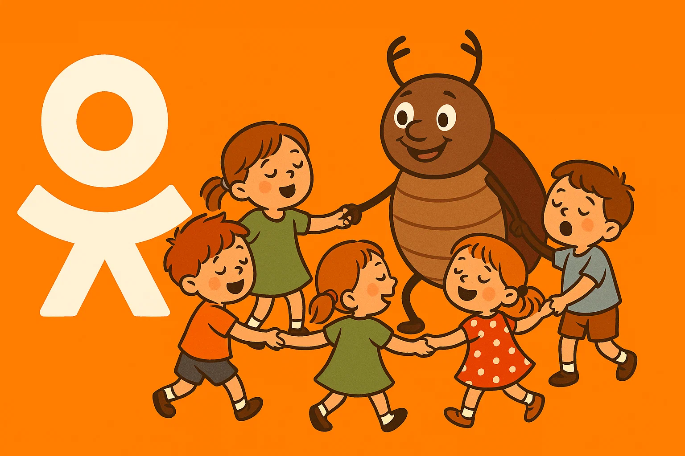

# ok-bot
ok-bot -Бот для сайта Одноклассники 2025


# «Встаньте, дети, встаньте в круг, встаньте в круг, встаньте в круг! Жил на свете добрый жук, старый добрый жук.»

# Одноклассники Bot

Node.js‑бот для автоматизации деятельности в социальной сети **Одноклассники**: поиск и добавление людей, общение через ChatGPT, репосты в группы, лайки, массовая обработка диалогов и многое другое. Проект построен вокруг **Puppeteer Real Browser**, принимает задания из MySQL‑очередей, использует многоуровневую систему «лейвелов» для надёжности действий и включает бек‑офис на PHP для управления ботами и диспетчеризации заданий. Внимание, не забудьте обновить npm-пакеты, а также код плагина 2captcha-solver! 

---

## Возможности

| Функция               | Описание                                                                                              |
| --------------------- | ----------------------------------------------------------------------------------------------------- |
| Репосты               | Поделиться постом произвольной группы в профиле бота.                                                 |
| Диалоги               | Авто‑ответы, приветственные открытки, стикеры, видео, поддержка любых тем с помощью ChatGPT.          |
| Поиск людей           | Поиск целевой аудитории и запуск сценария знакомства.                                                 |
| Менеджер очередей     | Actions Queue / Pre‑Queue / History c приоритетами и повторами.                                       |
| Браузер с анти‑детект | **puppeteer‑real‑browser** + динамическое кэширование статики и гибкая система прокси.                |
| Решение капчи         | Папка \`\` — сторонний плагин, полностью автоматизирует прохождение reCaptcha/HCaptcha/Turnstile.     |
| Бек‑офис              | PHP‑скрипты: балансировка прокси, массовый импорт аккаунтов, генерация и ремонт очередей, cron‑таски. |
| Сквозная логика       | Многоуровневые уровни (Levels) + Chain of Middlewares для надёжных повторов и обработки исключений.   |

---

## Архитектура проекта

```
📂 ok-bot/
├─ 2captcha-solver/           # Расширение Chrome для решения капч
├─ classes/                   # Router, BotVars, ChainOfMiddlewares, LevelsFactory, ...
├─ controllers/               # Page‑контроллеры (MessagesPageController, SearchPageController, ...)
├─ helpers/                   # sleepProm, globalLevelsExecute, formatErrorMessage, ...
├─ levels/                    # Группы уровней (messages/, search/, profile/, ...)
├─ php-backoffice/            # PHP‑скрипты управления (functions.php, proxy‑rebalance.php, ...)
├─ sql/                       # Начальный дамп БД
├─ .env.example               # Шаблон переменных окружения
└─ index.js                   # Главный цикл бота
```

### 1. MySQL схема

| Таблица                                   | Назначение                                                   |
| ----------------------------------------- | ------------------------------------------------------------ |
| **bots\_data**                            | Учетные данные аккаунтов, прокси, cookies, флаги активности. |
| **actions\_queue / pre\_queue / history** | Очереди заданий и их журнал.                                 |
| **dialogs**                               | Контекст активных переписок, тайминги, счётчики сообщений.   |
| **people\_pre\_send / worked**            | Фильтры, чтобы не спамить одним людям дважды.                |
| **stickers\_sended / video\_sended**      | Анти‑дупликаты вложений.                                     |
| **global\_vars / youtube\_data**          | Глобальные счётчики, пул видео на рассылку.                  |

Полный DDL лежит в `sql/ok_bot_schema.sql`.

### 2. Node.js‑слой

* **index.js** — запускает бесконечный цикл: берёт пачку действий `TimerController`, для каждого открывает/переиспользует браузер и делегирует действие в **Router**.
* **Router** динамически мапит путь (например, `messages/sendVideo`) на соответствующий контроллер и метод `*Action`.
* **BrowserController** — обёртка над puppeteer‑real‑browser: управление прокси, кэширование статических ресурсов, плавное обновление cookies в БД, helper‑методы (`type`, `click`, `hover`, …). При желании можно хранить полноценный профайл Chromium:

  ```js
  const { connect } = require('puppeteer-real-browser');
  const browser = await connect({
    customConfig: { userDataDir: '/path/to/profiles/bot_{{id}}' },
    ...
  });
  ```

### 3. Levels + ChainOfMiddlewares

Каждое действие разбивается на несколько **уровней**. Каждый уровень:

1. Наследует Parent‑класс (можно задавать общие проверки: авторизация, валидность страницы).
2. Реализует `handle(args)` с кастомной логикой.
3. Ограничен `maxRetries`, `interval` — определяется при сборке цепочки.

`LevelsFactory()` генерирует «Level1», «Level2» … классы на лету, что радикально сокращает шаблонный код.

### 4. PHP бек‑офис

* **ActionsController** (functions.php) — демонический процесс/cron‑скрипт: чистит очереди, создаёт новые действия по правилам, балансирует ботов.
* **proxy‑rebalance.php** — перераспределяет список прокси между активными аккаунтами по максимуму равномерно.
* **import‑accounts.php** — массовый импорт логин:пароль в `bots_data`.

Статичные сайты (админка) обращаются к этим обработчикам АЯКСом.

---

## Установка

### 1. Системные зависимости

* Node.js ≥ 18
* npm / pnpm
* MySQL 8+
* PHP 8 (для backoffice)
* `google-chrome` или Chromium (если запускаете без скачивания puppeteer‑binary)

### 2. Клонирование и зависимости

```bash
$ git clone https://github.com/arsen-y/ok-bot.git
$ cd ok-bot
$ npm i        # puppeteer‑real‑browser подтянется автоматически
```

### 3. Настройка БД

```bash
$ mysql -u root -p < sql/ok_bot_schema.sql
```

Заполните таблицу `bots_data` вашими аккаунтами / прокси (или используйте backoffice‑импорт).

### 4. Переменные окружения

Создайте `.env` от шаблона:

```dotenv
DBHOST=127.0.0.1
DBUSER=okbot
DBPASSWORD=secret
DBNAME=okBot

OPENAIKEY=sk-****************************
```

### 5. Запуск воркера

```bash
# авто‑режим (кричит в консоль, перезапускает сам себя)
$ node index.js

# ручной запуск одного действия
$ node index.js -i 3 \
                -r "messages/sendSticker" \
                -s "https://ok.ru/messages/123456789" \
                -p "123456789"  # param1
```

Опции:

* **-w** — запустить в режиме *watcher* (приоритет действий‑наблюдателей).
* **-n** — брать задания только для неактивных ботов.
* **-d** — выключить фильтр сетевых запросов (загружать все ресурсы).

### 6. Cron‑таски

Пример `crontab -e` (Europe/Moscow):

```cron
# Ежеминутно — менеджер действий (пропускает 01:00‑09:00)
* * * * * php php-backoffice/actions_daemon.php >> /var/log/okbot/actions.log 2>&1

# Раз в час — ребаланс прокси
0 * * * * php php-backoffice/proxy-rebalance.php --auto >> /var/log/okbot/proxy.log 2>&1
```

---

## Добавление нового сценария

1. Создайте контроллер `controllers/MyPageController.js`.
2. Опишите методы `myCoolAction(args)`.
3. Создайте каталог `levels/myPage/MyCoolLevels/` и реализуйте уровни.
4. Добавьте маршрут в `index.js` → `routes`.
5. Поместите задание в `actions_queue` или вызовите руками через CLI.

---

## 2captcha‑solver

Каталог \`\` содержит готовое расширение, которое:

* Автоматически перехватывает reCAPTCHA v2/v3, hCaptcha, Cloudflare Turnstile.
* Работает через API сервиса 2captcha (нужен ключ в настройках расширения).
* Интегрируется с puppeteer‑real‑browser без дополнительного кода: расширение подгружается аргументом

  ```bash
  --load-extension=2captcha-solver
  ```

Рекомендуется держать ключ 2captcha в переменной окружения профиля Chrome.

---

## Безопасность и анти‑детект

* **puppeteer-real-browser** — стартует настоящий пользовательский Chrome с нативным профилем, проходя большинство анти‑бот проверок.
* Проксирование / резидентные прокси с авторизацией (`ip:port:user:pass`) поддерживаются из коробки.
* Ограничения на кол‑во запросов в `BrowserController` и рандомные sleep‑задержки минимизируют риски блокировок.

---

## Лицензия

Арсений Соколовский © 2025 — автор проекта. Используйте на свой страх и риск, автор не несет ответственности за злоупотребление софтом, программное обеспечение представлено исключительно в демонстративных целях, как можно автоматизировать работу с сайтом исключительно для законных целей с целью повышения удобства использования (а также для разработки более эффективных систем защит).

---

**Happy automation!**
